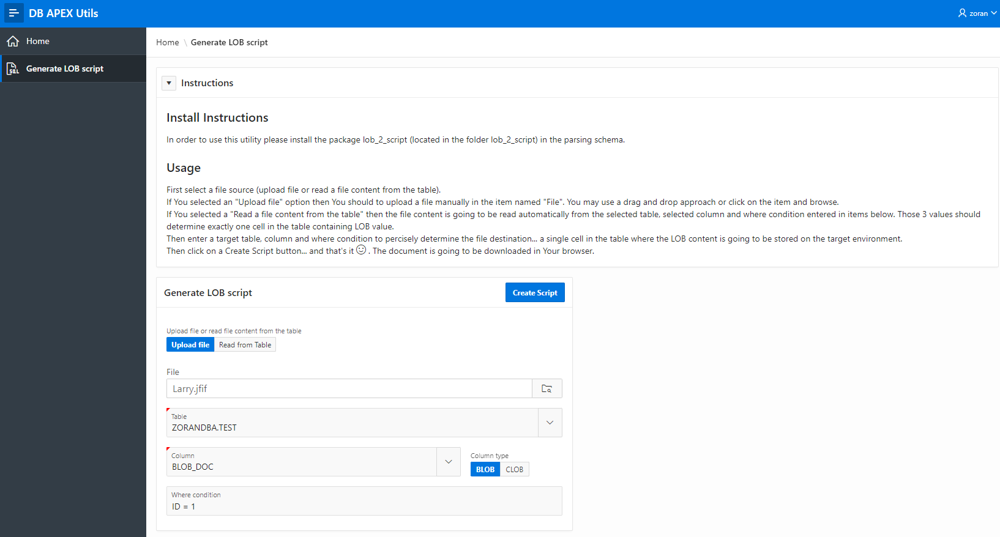
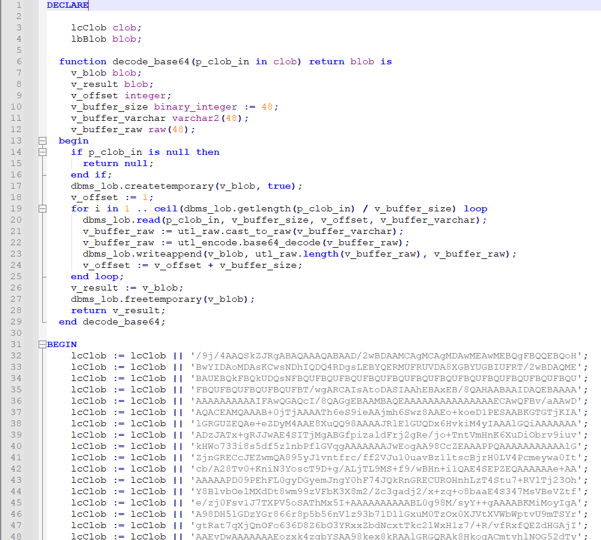
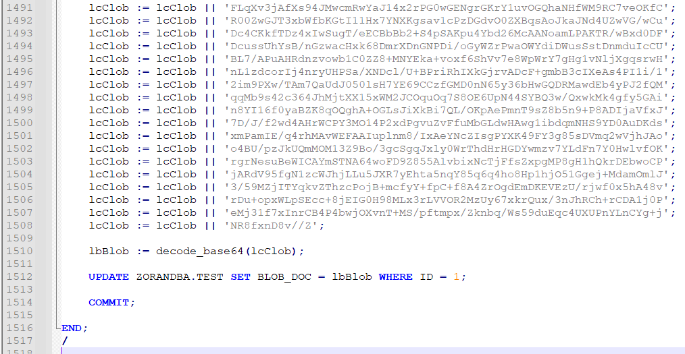

# "Lob 2 Script" utility

The utility provides You functionality to create PL/SQL script from a binary file content (LOB).<br>
Produced script can be included in Your patches and executed on the target environment, storing the LOB content in the database table cell.<br>
It can be useful to move images, Word or Execl documents and other binary or large text files between various databases / environments.<br>
I find it very useful when I need to include binary files in my patches such as APEX Office Print templates, PDF files or images, which content is going to be stored in the database tables. 

## History of changes:
- 1.0 - initial version

## Install instructions
- Create the package specification and the package body in the target schema.
- Optionally import the [APEX application](https://github.com/zorantica/db_apex_utils/tree/main/application) in Your workspace for easier usage of this utility (APEX 19.2 or newer).

## Usage

### From APEX UI:
First select a file source (upload a file or read a file content from the table).<br>
If You selected an "Upload file" option then You should to upload a file manually in the item named "File". You may use a drag and drop approach or click on the item and browse.<br>
If You selected a "Read a file content from the table" then the file content is going to be read automatically from the selected table, selected column and where condition entered in items below. Those 3 values should determine exactly one cell in the table containing LOB value.<br>
Then enter a target table, column and where condition to percisely determine the file destination... a single cell in the table where the LOB content is going to be stored on the target environment.<br>
Then click on a Create Script button... and that's it. The document is going to be downloaded in Your browser.



The generated PL/SQL script looks like this:



...




### From PL/SQL script
```sql
DECLARE
    l_script clob;

BEGIN
    l_script := 
        lob_2_script.f_generate_script (
            p_table => 'ZORANDBA.TEST',
            p_column => 'BLOB_DOC',
            p_column_type => 'B',
            p_where => 'ID = 1',
            p_lob_source => 'TABLE'
        );

END;
```

## Program unit specs

### Function f_generate_script

Function returns a CLOB value containg a PL/SQL script, which can be included in the patch or executed in the target environment.

Parameters:
- p_table - target table, in which the LOB contect is going to be stored  
- p_column - target table column (CLOB or BLOB), in which the LOB contect is going to be stored
- p_column_type - C for CLOB or B for BLOB
- p_where - where condition for the target table, which determines one record, in which the LOB content is going to be stored; the combination of column and where condition is determining one table cell to store LOB content 
- p_lob_source - LOB content source; values are: "PARAM" (content is read from function input parameter p_file), "APEX_VIEW" (a single file from APEX_APPLICATION_TEMP_FILES view - used for APEX UI), "READ_FROM_TABLE" (read from the database table - the cell containing the content is deteremined by function parameters p_table, p_column and p_where)
- p_file - a blob content, if the p_lob_source is "PARAM"

